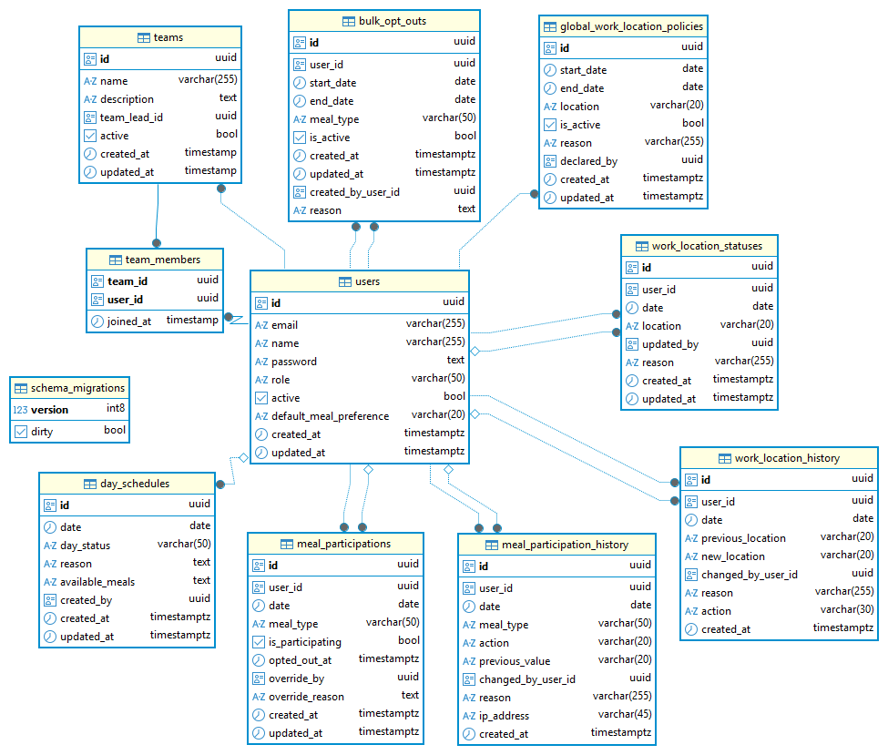

## 4. Tech Stack and Rationale

### Frontend

| Technology          | Version | Rationale                                               |
| ------------------- | ------- | ------------------------------------------------------- |
| **React**           | 19.x    | Industry standard, team familiarity, large ecosystem    |
| **TypeScript**      | 5.x     | Type safety, reduced runtime errors, better IDE support |
| **Vite**            | 7.x     | Fast dev server, optimized builds                       |
| **Tailwind CSS**    | 4.x     | Rapid development, utility-first, consistent design     |
| **Zustand**         | 5.x     | Lightweight state management, simple API                |
| **Axios**           | 1.x     | Interceptors, better error handling                     |
| **React Router**    | 7.x     | Standard routing solution, type-safe                    |
| **React Hook Form** | 7.x     | Performant form handling, easy validation               |
| **date-fns**        | 3.x     | Lightweight, modular, tree-shakeable                    |

### Backend

| Technology     | Version | Rationale                                   |
| -------------- | ------- | ------------------------------------------- |
| **Go**         | 1.23.x  | Performance, concurrency, simple deployment |
| **Gin**        | 1.10.x  | Fast, minimal, excellent routing            |
| **PostgreSQL** | 17.x    | ACID compliance, reliability, JSON support  |
| **GORM**       | 1.25.x  | Popular Go ORM, migration support           |
| **JWT**        | 5.x     | Stateless authentication, scalable          |
| **bcrypt**     | Latest  | Secure password hashing                     |
| **Zap**        | 1.x     | Structured logging, high performance        |

**Architecture Pattern:** Three-tier architecture with clean architecture principles (Handler → Service → Repository → Model layers)

---

## 8. Design

### System Architecture

```
┌─────────────────────────────────────────┐
│         Client (Browser)                │
│    React + TypeScript SPA               │
│    State: Zustand (global)              │
│    SSE Client (live headcount updates)  │
└──────────────┬──────────────────────────┘
               │ HTTPS/REST API + SSE
┌──────────────▼──────────────────────────┐
│      Application Server (Go + Gin)      │
│  ┌────────────────────────────────────┐ │
│  │  Authentication Middleware (JWT)   │ │
│  │  Authorization Middleware (RBAC)   │ │
│  │  Handler → Service → Repository    │ │
│  │  SSE Hub (live headcount updates)  │ │
│  └────────────────────────────────────┘ │
└──────────────┬──────────────────────────┘
               │
┌──────────────▼──────────────────────────┐
│      PostgreSQL Database (17.x)         │
│  - users (with default_meal_preference) │
│  - teams                                │
│  - team_members                         │
│  - meal_participations                  │
│  - meal_participation_history           │
│  - bulk_opt_outs                        │
│  - day_schedules                        │
│  - work_locations                       │
│  - wfh_periods                          │
│  - team_bulk_actions                    │
└─────────────────────────────────────────┘
```

### Entity Relationship Diagram



### Frontend Component Structure

```
src/
├── components/
│   ├── layout/          # Page structure: Header, Navbar, Footer, BottomActionButtons
│   ├── cards/           # Reusable card components: EmployeeMenuCard, InteractiveCard, StandardCard, AccentBorderCard, TeamCard
│   ├── forms/           # Form controls: Button, IconButton, Dropdown, Input fields
│   ├── modals/          # Modal dialogs: MealModal, MealOptOutModal, BulkActionModal, WorkLocationModal, AnnouncementModal
│   ├── views/           # Feature views: TeamView, AnnouncementView
│   └── feedback/        # User feedback: Toast notifications, Loading spinners, error messages
├── pages/
│   ├── AdminTeamParticipation.tsx    # Admin/Logistics team participation view
│   ├── GlobalWFH.tsx                 # Global Work From Home period management and view
│   ├── HeadcountDashboard.tsx        # Admin/Logistics headcount view and reports (with live updates)
│   ├── Home.tsx                      # Main dashboard with overview
│   ├── LoginPage.tsx                 # Authentication page
│   ├── OverridePanel.tsx             # Admin & Team lead override and team management
│   ├── Registration.tsx              # Registration page
│   ├── Schedule.tsx                  # Schedule management and view
│   ├── TeamParticipation.tsx         # Team lead meal participation view
├── services/            # API service layer: HTTP client, API endpoint wrappers, WebSocket client
├── store/               # Zustand state management: Auth store, meal store, global state
├── types/               # TypeScript type definitions: Interfaces, enums, API response types
├── hooks/               # Custom React hooks: useAuth, useMeals, useHeadcountSSE
└── utils/               # Helper functions: Date formatting, validators, constants, utility functions
```

**Key Directories:**

- **components/**: Reusable UI components organized by category
- **pages/**: Top-level route components (one per main route)
- **services/**: Centralized API communication layer
- **store/**: Global application state (authentication, user data)
- **types/**: Shared TypeScript interfaces and types
- **hooks/**: Custom React hooks for logic reuse, SSE integration
- **utils/**: Pure utility functions and constants

### Backend package Structure

```
cmd/
└── server/
    └── main.go                 # Application entry point

internal/
├── config/
│   └── config.go              # Configuration management
├── handlers/
│   ├── auth_handler.go        # Authentication endpoints
│   ├── meal_handler.go        # Meal participation endpoints
│   ├── user_handler.go        # User management endpoints
│   ├── headcount_handler.go   # Headcount reporting endpoints
│   ├── headcount_sse.go       # Headcount live updates via Server-Sent Events
│   ├── schedule_handler.go    # Day schedule management endpoints
│   ├── preference_handler.go  # User preference endpoints
│   ├── bulk_optout_handler.go # Bulk opt-out endpoints
│   ├── history_handler.go     # Meal history endpoints
│   ├── work_location_handler.go    # Work location endpoints (Iteration 2)
├── middleware/
│   ├── auth.go                # JWT authentication
│   ├── cors.go                # CORS configuration
│   ├── logger.go              # Request logging
│   ├── recovery.go            # Panic recovery
│   └── request_id.go          # Request ID tracking
├── models/
│   ├── user.go                        # User entity
│   ├── meal_participation.go          # Meal Participation entity
│   ├── meal_participation_history.go  # Meal Participation History entity
│   ├── schedule.go                    # Day schedule entity
│   ├── role.go                        # Role definitions
│   ├── history.go                     # Participation history entity
│   ├── bulk_optout.go                 # Bulk opt-out entity
│   ├── team.go                        # Team and TeamMember entities
│   └── bulk_opt_out.go                # Bulk action entity
│   ├── work_location.go               # Work location entity
├── repository/
│   ├── user_repository.go     # User data access
│   ├── meal_repository.go     # Meal data access
│   ├── schedule_repository.go # Schedule data access
│   ├── history_repository.go  # History data access
│   ├── bulk_optout_repository.go # Bulk opt-out data access
│   ├── team_repository.go     # Team data access
│   ├── work_location_repository.go    # Work location data access
├── services/
│   ├── auth_service.go        # Authentication logic
│   ├── meal_service.go        # Meal business logic (ENHANCED)
│   ├── schedule_service.go    # Schedule business logic
│   ├── user_service.go        # User management logic
│   ├── headcount_service.go   # Headcount calculations (ENHANCED)
│   ├── preference_service.go  # User preference logic
│   ├── bulk_optout_service.go # Bulk opt-out logic
│   ├── history_service.go     # History tracking logic
│   ├── participation_resolver.go # Participation status resolution
│   ├── work_location_service.go    # Work location logic
│   ├── utils.go                  # Utility logic
├── sse/
│   ├── hub.go                 # WebSocket connection hub
├── jobs/
│   └── cleanup_job.go         # History cleanup cron job
└── utils/
    ├── jwt.go                 # JWT utilities
    ├── password.go            # Password hashing
    ├── validator.go           # Custom validators
    └── response.go            # Standard response formats
```

---

## 9. Key Decisions and Trade-offs

### Decision 1: Default Preference Model

**Decision:** Implement user-level default preference (opt-in or opt-out) rather than requiring explicit opt-in/out for every meal.

**Rationale:**

- Reduces daily interaction burden for users
- Matches real-world behavior (most people have consistent patterns)
- Exceptions handled via specific records or bulk opt-outs

**Trade-offs:**

- More complex participation resolution logic
- Need to clearly communicate how defaults work
- ✅ Chosen for better UX

### Decision 2: Database Choice - PostgreSQL

**Decision:** PostgreSQL over MySQL or MongoDB.

**Rationale:**

- ACID compliance critical for meal counts
- Strong JSON support for flexible data (day schedules)
- Team familiarity
- Excellent performance for this scale

**Trade-offs:**

- More resource-intensive than MySQL
- ✅ Chosen for reliability and features

### Decision 3: JWT for Authentication

**Decision:** Stateless JWT tokens over session-based authentication.

**Rationale:**

- Scalability (no server-side session storage)
- Simpler deployment (no session store needed)
- Standard approach for API-first design

**Trade-offs:**

- Cannot revoke tokens before expiry (mitigated with 24-hour expiry)
- ✅ Chosen for simplicity and scalability

### Decision 4: Go + Gin for Backend

**Decision:** Go with Gin framework over Node.js/Express or Python/Django.

**Rationale:**

- Better performance and concurrency
- Single binary deployment (simpler operations)
- Strong typing and compile-time checks
- Team expanding Go expertise

**Trade-offs:**

- Smaller ecosystem than Node.js
- Less team familiarity initially
- ✅ Chosen for performance and operational simplicity

### Decision 5: Zustand over Redux

**Decision:** Zustand for state management instead of Redux or Context API.

**Rationale:**

- Much simpler API than Redux
- Better performance than Context API
- Smaller bundle size
- Sufficient for application complexity

**Trade-offs:**

- Less tooling/devtools than Redux
- ✅ Chosen for simplicity and team velocity

---
